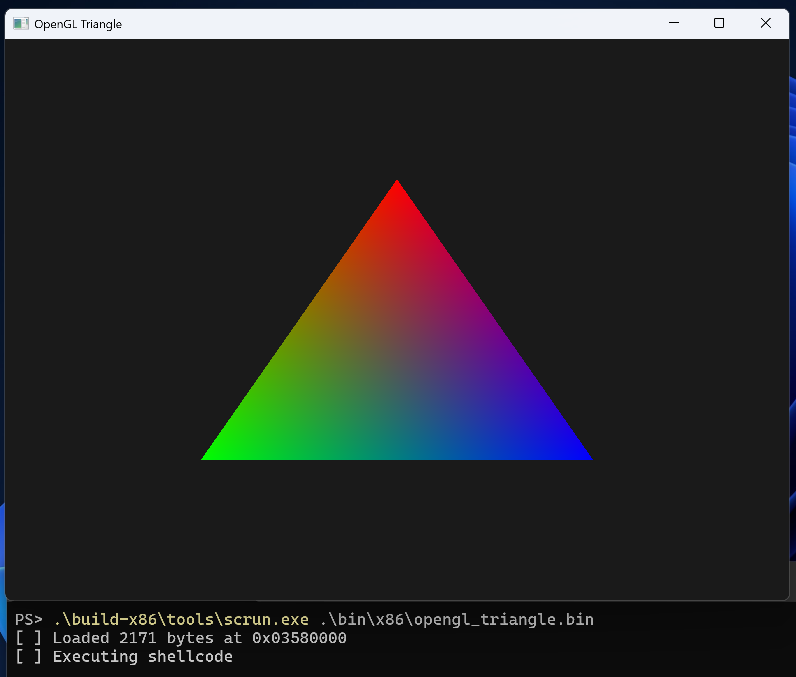
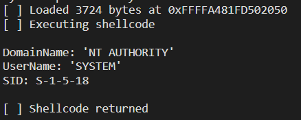

# scfw

A cross-platform C++ framework for building Windows shellcode.
Supports Linux, macOS, or Windows development environments.
Creates position-independent blob that runs in user-mode or kernel-mode, x86 or x64.

```cpp
#include <scfw/runtime.h>
#include <scfw/platform/windows/usermode.h>

IMPORT_BEGIN();
    IMPORT_MODULE("kernel32.dll");
        IMPORT_SYMBOL(WriteConsoleA);
IMPORT_END();

namespace sc {

extern "C" void __fastcall entry(void* argument1, void* argument2)
{
    HANDLE StdOut = NtCurrentPeb()->ProcessParameters->StandardOutput;
    WriteConsoleA(StdOut, _T("Hello, World!\n"), 14, NULL, NULL);
}

} // namespace sc
```

Build it, extract the `.text` section, and you have a self-contained shellcode binary that resolves its own imports at runtime.

## Motivation

As with all my projects, it boils down to _"I need that, current solutions were unsatisfactory, and I want to learn something"_.

I like to experiment with <abbr title="Virtual Machine Introspection">VMI</abbr> and sometimes it's really useful to be able to inject a piece of code into the memory of some process (and/or kernel) and execute it. And because [`vmi-rs`](https://github.com/vmi-rs/vmi) development happens on Linux, and my daily driver became macOS, I wanted a convenient way to generate Windows shellcode on them.

Although compression and "non-null" shellcode are not the primary goals of this project, they might be interesting additions in the future.

## Table of Contents

- [Motivation](#motivation)
- [Installation](#installation)
- [Building](#building)
- [Running Shellcode](#running-shellcode)
- [Architecture](#architecture)
  - [The Dispatch Table](#the-dispatch-table)
  - [Section Layout](#section-layout)
  - [Position-Independent Code](#position-independent-code)
- [User-Mode Shellcode](#user-mode-shellcode)
- [Kernel-Mode Shellcode](#kernel-mode-shellcode)
- [Compile-Time Options](#compile-time-options)
- [Per-Entry Flags](#per-entry-flags)
- [CMake Build Options](#cmake-build-options)
- [Examples](#examples)
- [License](#license)

## Installation

### Prerequisites

_scfw_ cross-compiles Windows shellcode from any host OS. You don't need a Windows machine to build.

- **CMake** 3.22+
- **Ninja** build system
- **clang** clang 19+
  - _**Note:**_ On Windows, clang 21.* currently experiences issues with `/FILEALIGN:1` during linking.
    If you encounter linker errors, try to compile with `-DSCFW_FILE_ALIGNMENT=0` or switch to older clang version.
- **LLVM tools**: `lld-link`, `llvm-objcopy`, `llvm-readobj`
- **Windows SDK** headers and libraries (can be fetched automatically on any platform, see below)

### Dependencies

**[phnt](https://github.com/winsiderss/phnt)** (Windows native API headers) is fetched automatically by CMake via `FetchContent`. No action needed.

**Windows SDK** is the only dependency that requires some setup, especially on non-Windows hosts. On Windows with MSVC, CMake detects the system SDK automatically. On macOS and Linux (or Windows without the SDK), CMake will tell you it's missing and suggest how to fetch it.

The easiest option is to let CMake download it for you:

```bash
cmake --preset x64 -DSCFW_FETCH_WINSDK=ON
```

This runs `scripts/fetch-winsdk.sh` (or `fetch-winsdk.ps1` on Windows), which uses [xwin](https://github.com/Jake-Shadle/xwin) to download the Windows SDK. If `xwin` isn't installed, the script looks for Rust toolchain and installs `xwin` via `cargo install`. If Rust isn't installed either, the script downloads a temporary Rust toolchain, installs `xwin`, downloads the SDK, and then cleans up both the Rust toolchain and `xwin`. Nothing is left behind on your system - the temporary installations are fully isolated.

Alternatively, you can manually place the Windows SDK into the `winsdk/` directory at the project root. The expected structure is:

```
winsdk/
  crt/
    include/
    lib/{x86,x86_64}/
  sdk/
    include/{ucrt,um,shared}/
    lib/{um,ucrt}/{x86,x86_64}/
```

## Building

The project uses CMake presets for convenience:

```bash
# x64 Release
cmake --preset x64
cmake --build build-x64

# x86 Release
cmake --preset x86
cmake --build build-x86
```

Debug builds are also available (`x64-debug`, `x86-debug`), but shellcode extraction is disabled in Debug mode. You get a PE executable for debugging instead.

After building, each example produces both a `.exe` and a `.bin` (the extracted shellcode).

## Running Shellcode

The `scrun` tool loads a shellcode binary into executable memory and runs it. It's built alongside the examples and requires Windows to run.

```
.\build-x64\tools\scrun.exe .\build-x64\examples\writeconsole\writeconsole.bin
.\build-x64\tools\scrun.exe .\build-x64\examples\opengl_triangle\opengl_triangle.bin
.\build-x86\tools\scrun.exe .\build-x86\examples\messagebox\messagebox.bin
```

`scrun` accepts two optional arguments that are passed to the shellcode via the first and second parameters (RCX/ECX and RDX/EDX respectively):

```
.\build-x64\tools\scrun.exe shellcode.bin 0x12345 0x67890
```

After the shellcode returns, `scrun` checks whether the shellcode freed its own memory (i.e. whether `SCFW_OPT_CLEANUP` was enabled) and reports the result.

> **Fun fact:** on Windows on ARM64, the binary translation layer can run both x86 and x64 shellcodes via `scrun`. However, when emulating x64, `xtajit64.dll` (or `xtajit64se.dll`) is the 2nd module in the PEB load order instead of `kernel32.dll`, which breaks the fast-path lookup. If your shellcode imports from `kernel32.dll` and you want it to work under ARM64 emulation, define `SCFW_ENABLE_FULL_MODULE_SEARCH` to use the generic PEB walker instead.

<p align="center">
    
    <br>
    <em>Those who'd like to point out that more impressive sub-4kB demos exist will be mercilessly frowned upon.</em>
</p>

## Architecture

_scfw_ compiles your code into a PE executable, then extracts the `.text` section as a raw binary. The trick is getting everything (code, data, constants, and the import resolution logic) into that single section, in the right order, with no absolute address fixups.

### The Dispatch Table

The core of _scfw_ is a dispatch table built entirely at compile time using C++ template metaprogramming. Each `IMPORT_MODULE` and `IMPORT_SYMBOL` macro creates a new template specialization that inherits from the previous one, forming a chain:

```
dispatch_table_impl<0, Mode>         base class
  - holds fn pointers: cleanup_, free_, load_module_, unload_module_, lookup_symbol_
  - provides find_module(), lookup_symbol()
        |
dispatch_table_impl<1, Mode>         IMPORT_MODULE("kernel32.dll")
  - adds: module_ (handle to loaded/found module)
  - init() calls find_module() or load_module()
        |
dispatch_table_impl<2, Mode>         IMPORT_SYMBOL(WriteConsoleA)
  - adds: slot_WriteConsoleA_ (typed function pointer)
  - init() resolves the symbol from the parent module
        |
dispatch_table                       IMPORT_END (final alias)
```

The `__COUNTER__` macro gives each entry a unique ID, and `IMPORT_END()` seals the chain, instantiates a global `__dispatch_table`, and generates the `_entry()` wrapper function. This wrapper initializes the dispatch table (resolving all modules and symbols), calls your `entry()` function, and optionally tears things down (e.g. `FreeLibrary` for dynamically loaded modules).

After `IMPORT_END()`, imported symbols are accessible through proxy objects in the `sc` namespace. When you write `WriteConsoleA(...)` in your code, it reads the function pointer from the dispatch table and calls through it. There's no runtime metadata, no string tables, no relocation records. Just a flat struct of function pointers.

### Section Layout

The linker merges `.data` and `.rdata` into `.text`, producing a single PE section with read/write/execute permissions. Within `.text`, ordering is controlled via MSVC-style subsection naming (`.text$00`, `.text$10`, ...), which the linker sorts alphabetically:

```
Section       Contents                    Source
.text$00      _init                       lib/src/arch/*/init.S
.text$10      _start, _pc, _cleanup_*     lib/src/arch/*/start.S
.text$20      _entry                      generated by IMPORT_END()
.text$aaa     framework code              runtime.h, crt0.h, ...
.text$yyy     user code                   your entry() and everything after
```

`_init` is the PE entry point. It must be at the very beginning of the binary since that's where execution starts when you jump to the shellcode's base address. The startup code, dispatch table initialization, and user code follow in a deterministic order.

After building, a post-build step verifies the PE has exactly one section (or two, if debug info is enabled) and extracts `.text` to the final `.bin` file using `llvm-objcopy`.

### Position-Independent Code

Shellcode can be loaded at any address, so all memory references must be position-independent. This is where x86 and x64 diverge.

**x64** has RIP-relative addressing, so `mov rax, [rip + symbol]` just works. The compiler generates position-independent code by default and `_pic()` is a no-op. Nothing special is needed.

**x86** doesn't have an instruction pointer-relative addressing mode. The compiler generates absolute addresses like `mov eax, offset symbol`, and those addresses are wrong when the shellcode is loaded somewhere other than its compile-time base.

_scfw_ solves this with a runtime PIC relocation scheme. It relies on the fact that while absolute addresses change, the *differences* between addresses stay the same no matter where the code is loaded. The `_pc()` function (implemented via the classic `call`/`pop` trick) returns its own runtime address:

```asm
_pc:
    call    1f
1:  pop     eax
    sub     eax, 5      ; call is 5 bytes
    ret
```

Then `_pic()` computes the correct runtime address of any compile-time symbol:

```
runtime_addr = _pc() - &_pc + compile_time_addr
```

In practice, the `_()` macro wraps this: on x86, `_(ptr)` applies the PIC delta; on x64, it's a pass-through. You'll see this in code like `wc.lpfnWndProc = _(&WndProc)` - on x86, function pointer addresses need the PIC adjustment too.

The linker flag `/FIXED` is used on x86 to suppress base relocations. Since _scfw_'s PIC scheme only relies on address *differences* (which are base-independent), no `.reloc` section is needed.

## User-Mode Shellcode

For user-mode shellcode, include `<scfw/platform/windows/usermode.h>`. Modules are found by walking the PEB's `InLoadOrderModuleList` and matching names. By default, `ntdll.dll` and `kernel32.dll` get a fast-path lookup (they're always the 2nd and 3rd entries in the list), while other modules require either a full PEB walk or `LoadLibraryA`.

The entry point signature is:

```cpp
extern "C" void __fastcall entry(void* argument1, void* argument2);
```

Both parameters are passed through from whoever invokes the shellcode. You can use them for whatever you want, or just ignore them.

If the shellcode doesn't use `SCFW_FLAG_DYNAMIC_LOAD`, then any modules it imports must already be loaded in the target process. If a module or symbol can't be resolved, the shellcode gracefully exits rather than crashing.

You can `#include <windows.h>` normally. Though the platform headers already include it along with _phnt_.

## Kernel-Mode Shellcode

_scfw_ also supports kernel-mode shellcode. Include `<scfw/platform/windows/kernelmode.h>` instead of the usermode header. See the `kernel_query_user` example for demonstration.

Kernel-mode shellcode expects the **ntoskrnl image base** to be passed as the first argument (ECX on x86, RCX on x64). This is deliberate - there isn't a reliable way to locate `ntoskrnl.exe` from kernel-mode code without risking crashes due to gaps between ntoskrnl sections. The example [kernel driver](assets/kernel_driver.c) shows how to obtain the image base using `RtlPcToFileHeader` and pass it to the shellcode:

```c
PVOID KernelBase = NULL;
RtlPcToFileHeader((PVOID)&RtlPcToFileHeader, &KernelBase);

((PSHELLCODE_ROUTINE)Shellcode)(KernelBase, PsGetCurrentProcess());
```

A few things to keep in mind (with not only kernel-mode shellcode):

- **Import only exported functions.** Some functions that appear in ntoskrnl headers are internal and can change between Windows releases or architectures. Stick to documented, exported symbols.
- **Variadic functions work.** You can use the sweet `DbgPrintEx` and `printf`. The `kernel_query_user` example uses `DbgPrintEx` to print formatted output.
- **Data symbol pointers are supported.** The `kernel_query_user` example imports `SeTokenObjectType` as a `POBJECT_TYPE*` - a pointer to a data symbol rather than a function.
- **No WDK required, but you'll need to define kernel types yourself.** Since there's no WDK in the build, you have to redeclare the kernel structures and prototypes you need (see the `kernel_query_user` example for how this looks in practice). The _phnt_ library may provide some useful definitions.
- **If a symbol can't be resolved, the shellcode exits gracefully.** Same as user-mode, no crashes on missing imports.
- **You can't test kernel shellcode with `scrun`.** Obviously. You'll have to take my word for it (or build a [test driver](assets/kernel_driver.c) and try it yourself).

<p align="center">
    
</p>

## Compile-Time Options

These are `#define`d before including `runtime.h`, or set via CMake target definitions. The defaults are chosen to produce the smallest possible shellcode. Each option you enable adds code.

| Option | Default | Description |
|--------|---------|-------------|
| `SCFW_ENABLE_LOAD_MODULE` | Off | Resolves `LoadLibraryA` at init time. Required if any module uses `SCFW_FLAG_DYNAMIC_LOAD` to load DLLs not already present in the target process. |
| `SCFW_ENABLE_UNLOAD_MODULE` | Off | Resolves `FreeLibrary` at init time. Required by `SCFW_FLAG_DYNAMIC_UNLOAD`. Only meaningful together with `DYNAMIC_LOAD`. |
| `SCFW_ENABLE_LOOKUP_SYMBOL` | Off | Resolves `GetProcAddress` at init time. Required by `SCFW_FLAG_DYNAMIC_RESOLVE`. Useful when the manual PE export walker isn't sufficient (e.g. forwarded exports). |
| `SCFW_ENABLE_XOR_STRING` | Off | XOR-encodes all strings passed through `_T()` at compile time. Decoded in-place on first access at runtime. Prevents module names, symbol names, and user strings from appearing in plaintext in the binary. Each string gets a key derived from `__LINE__`, so identical strings at different call sites have different encodings. |
| `SCFW_ENABLE_CLEANUP` | Off | The shellcode frees its own memory on exit via `VirtualFree` (user-mode) or `ExFreePool` (kernel-mode). **Must be set via the CMake option** `SCFW_OPT_CLEANUP`, not just `#define`d, because the assembly startup code depends on it. |
| `SCFW_ENABLE_FULL_MODULE_SEARCH` | Off | Disables the fast-path optimization for `ntdll.dll` and `kernel32.dll` (which reads them from hardcoded PEB offsets). When you're dynamically loading many modules anyway, the fast-path code is dead weight and this saves a few bytes. |
| `SCFW_ENABLE_FIND_MODULE_FORWARDER` | Off | Enables forwarded PE export handling in the manual export walker. Some exports redirect to another DLL (e.g., `user32!DefWindowProcA` forwards to `ntdll!NtdllDefWindowProc_A`). When enabled, the walker detects these and recursively resolves the target. Adds code size. |
| `SCFW_ENABLE_INIT_MODULES_BY_STRING` | Off | Uses string comparison instead of hash for module name matching during the base initialization. Adds plaintext module names to the binary. |
| `SCFW_ENABLE_INIT_SYMBOLS_BY_STRING` | Off | Uses string comparison instead of hash for symbol name matching during the base initialization. Adds plaintext symbol names to the binary. |

The `opengl_triangle` example is a good reference for seeing how these options interact in practice. It demonstrates several configurations with commentary on the size/compatibility trade-offs.

## Per-Entry Flags

Flags are passed via the `FLAGS()` macro in `IMPORT_MODULE` or `IMPORT_SYMBOL` declarations. You can also set defaults that apply to all entries:

```cpp
// Apply DYNAMIC_LOAD to all modules by default
#define SCFW_MODULE_DEFAULT_FLAGS  (SCFW_FLAG_DYNAMIC_LOAD)

// Per-module override: kernel32.dll is always loaded, skip LoadLibraryA
IMPORT_MODULE("kernel32.dll", FLAGS(0));
```

| Flag | Value | Description |
|------|-------|-------------|
| `SCFW_FLAG_DYNAMIC_RESOLVE` | `0x01` | Use `GetProcAddress` for symbol lookup instead of manually walking the PE export table. Implies `STRING_SYMBOL`. Set on a module to apply to all its symbols. Requires `SCFW_ENABLE_LOOKUP_SYMBOL`. |
| `SCFW_FLAG_DYNAMIC_LOAD` | `0x02` | Use `LoadLibraryA` to load the module instead of finding it in the PEB. For DLLs not already loaded in the target process (e.g. `user32.dll`, `opengl32.dll`). Requires `SCFW_ENABLE_LOAD_MODULE`. |
| `SCFW_FLAG_DYNAMIC_UNLOAD` | `0x04` | Call `FreeLibrary` on the module during teardown. Only valid together with `DYNAMIC_LOAD`. Requires `SCFW_ENABLE_UNLOAD_MODULE`. |
| `SCFW_FLAG_STRING_MODULE` | `0x08` | Match module names by string comparison instead of hash. Results in the full module name string being present in the binary. |
| `SCFW_FLAG_STRING_SYMBOL` | `0x10` | Match symbol names by string comparison instead of hash. Results in the full symbol name string being present in the binary. |

The defaults (`SCFW_MODULE_DEFAULT_FLAGS` and `SCFW_ENTRY_DEFAULT_FLAGS`) are both `0` unless you override them before including `runtime.h`.

## CMake Build Options

These are set globally via CMake cache variables and can be overridden per-target using CMake target properties.

| Option | Type | Default | Description |
|--------|------|---------|-------------|
| `SCFW_OPT_LTO` | `BOOL` | `ON` | Enable Link-Time Optimization. Generally reduces shellcode size by allowing the linker to eliminate dead code across translation units. However, it can sometimes *increase* size. The `opengl_triangle` example intentionally disables it because LTO produced a larger binary in that case. |
| `SCFW_OPT_DEBUG_INFO` | `BOOL` | `OFF` | Create a `.pdb` file and include CodeView debug info in the output PE. Useful for debugging with a disassembler, but adds an `.rdata` section to the PE. |
| `SCFW_OPT_CLEANUP` | `BOOL` | `OFF` | Enable self-cleanup. The shellcode calls `VirtualFree` (user-mode) or `ExFreePool` (kernel-mode) to free its own memory before returning. This maps to `SCFW_ENABLE_CLEANUP` and also controls whether the assembly startup wrapper (`start.S`) is linked in. |
| `SCFW_FUNCTION_ALIGNMENT` | `STRING` | `1` | Function alignment in bytes. The default of 1 means no padding between functions, producing the smallest binary. Set this to `0` to use the linker's default function alignment. Affects both C++ code (`-falign-functions=N`) and assembly (`.p2align`). |
| `SCFW_FILE_ALIGNMENT` | `STRING` | `1` | PE file alignment in bytes. The default of 1 produces the smallest possible PE, but it's technically an invalid PE. Windows loaders (and even IDA Pro) may reject it. The shellcode itself works fine. Set this to `0` to use the linker's default file alignment, which produces a valid PE that you can execute directly as an `.exe`, at the cost of some padding. |
| `SCFW_OPT_ZERO_BASE` | `BOOL` | `OFF` | x86 only. Sets the PE image base to 0 (`/BASE:0`), so shellcode offsets match raw file offsets. Handy for analysis, but doesn't reduce shellcode size (x86 `imm32` is always 4 bytes regardless of value) and makes the `.exe` non-executable. |

Per-target override example:

```cmake
add_executable(opengl_triangle main.cpp)
target_link_libraries(opengl_triangle PRIVATE scfw)

# LTO makes this particular binary bigger, so disable it
set_target_properties(opengl_triangle PROPERTIES SCFW_OPT_LTO OFF)

scfw_extract_shellcode(opengl_triangle)
```

## Examples

| Example | x86 | x64 | Description |
|---------|----:|----:|-------------|
| `empty` | 16 B | 8 B | Bare-minimum template with an empty `entry()` function. Use as a starting point. |
| `writeconsole` | 319 B | 303 B | Writes "Hello, World!" to the console via `WriteConsoleA`. Simplest useful example. |
| `writeconsole_xor` | 377 B | 373 B | Same as `writeconsole`, but built with `SCFW_ENABLE_XOR_STRING`. All strings are XOR-encoded in the binary and decoded at runtime. |
| `messagebox` | 495 B | 459 B | Shows a `MessageBoxA` dialog. Demonstrates `SCFW_FLAG_DYNAMIC_LOAD` since `user32.dll` isn't loaded by default in console processes. |
| `opengl_triangle` | 2171 B | 2433 B | Renders an OpenGL triangle from shellcode. Dynamically loads `user32.dll`, `gdi32.dll`, and `opengl32.dll`. Extensively documented with commentary on compile-time option trade-offs. Refer to this example for practical demonstrations of options and flags in action. |
| `kernel_query_user` | 3184 B | 3268 B | Kernel-mode shellcode that queries the current process's user information (domain, username, SID) and prints it via `DbgPrintEx`. Demonstrates kernel-mode imports, data symbol pointers (`SeTokenObjectType`), and variadic function calls. |

## See Also

- **[Stardust]**: A similar project by [Cracked5pider].

## License

This project is licensed under the MIT license.

[Stardust]: https://github.com/Cracked5pider/Stardust
[Cracked5pider]: https://github.com/Cracked5pider
